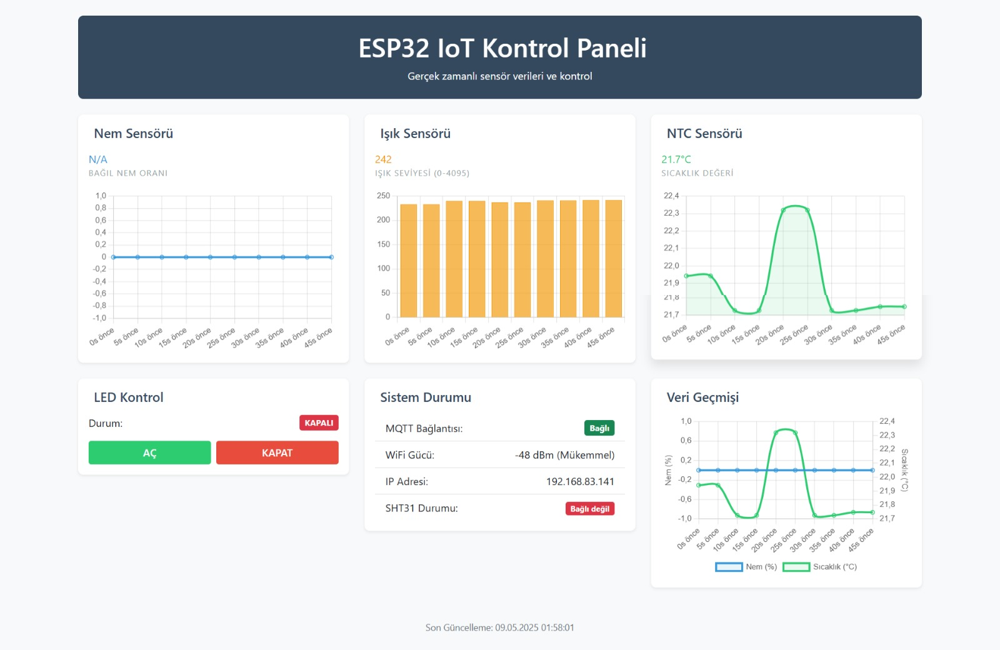
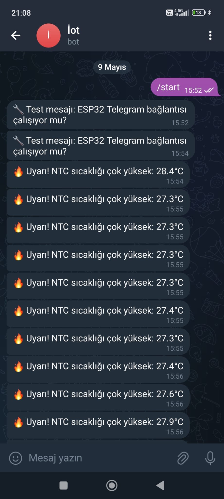
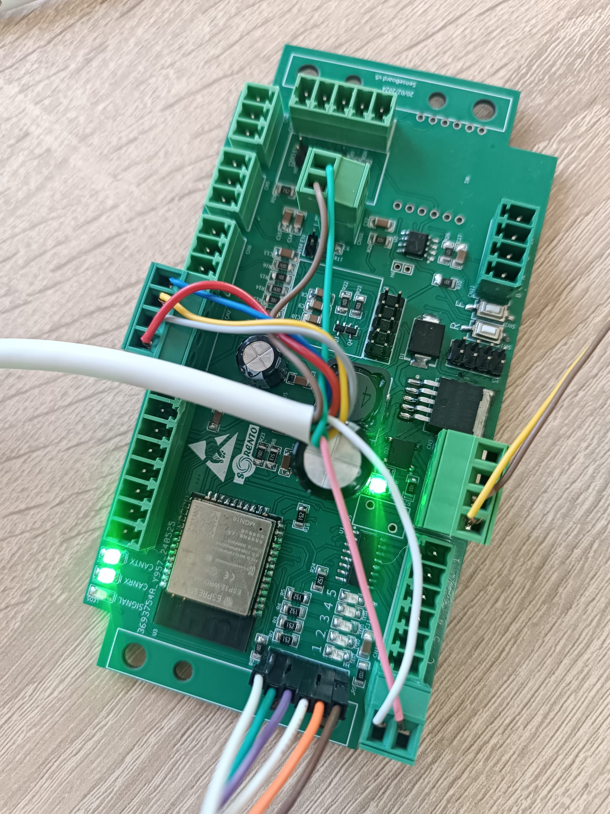

<!-- LANGUAGE SWITCH -->

  
  

[![Forks][forks-shield]][forks-url]
[![Stargazers][stars-shield]][stars-url]
[![Issues][issues-shield]][issues-url]

---

## English Version

<h3 align="center">Real-time IoT Monitoring with Telegram Alerts</h3>

### 📌 Overview

**Real-time IoT Monitoring with Telegram Alerts** is an end-to-end IoT project developed using an **ESP32 microcontroller**.  
The system collects environmental data (temperature, humidity, and light), transmits it via **MQTT**, visualizes it on a **web dashboard**, and sends **instant Telegram alerts** when predefined threshold values are exceeded.

This project demonstrates the integration of embedded systems, web technologies, and cloud-based messaging platforms.

---

## 🖼️ System Screenshots

### 🔹 Web Dashboard
Real-time sensor monitoring and device control interface.

---

### 🔹 Telegram Alert System
Automatic Telegram notifications with critical alerts.

---

### 🔹 Hardware Setup
ESP32 and sensor connections.

---

## ⚙️ System Features

- Real-time environmental data acquisition  
- MQTT-based data transmission (HiveMQ Cloud)  
- Responsive web-based dashboard  
- Telegram bot integration for instant alerts  
- Remote device control via web interface  

---

## 🛠️ Technologies Used

### Hardware
- ESP32 Microcontroller  
- SHT31 Temperature & Humidity Sensor  
- NTC Thermistor  
- LDR (Light Dependent Resistor)  

### Software & Communication
- Arduino (C++)  
- MQTT (HiveMQ Cloud)  
- HTTP Web Server  
- Telegram Bot API  
- HTML, CSS, JavaScript  

---

## 👤 Project Author

- **Hilmi Can Ürlü**

---

## 📧 Contact

Email:  
Website:  

---

## Türkçe Versiyon

<h3 align="center">Telegram Uyarılı Gerçek Zamanlı IoT İzleme Sistemi</h3>

### 📌 Genel Bakış

**Real-time IoT Monitoring with Telegram Alerts**, **ESP32 mikrodenetleyicisi** kullanılarak geliştirilen uçtan uca bir IoT projesidir.  
Sistem; sıcaklık, nem ve ışık verilerini sensörlerden okuyarak **MQTT protokolü** ile iletir, bir **web arayüzü** üzerinden görselleştirir ve kritik eşik değerleri aşıldığında **Telegram üzerinden anlık uyarılar** gönderir.

Bu proje, gömülü sistemler ile web ve bulut tabanlı haberleşme servislerinin entegrasyonunu göstermektedir.

---

## 🖼️ Sistem Görselleri

### 🔹 Web Arayüzü
Gerçek zamanlı sensör verilerinin izlendiği dashboard.

---

### 🔹 Telegram Uyarıları
Kritik durumlarda otomatik gönderilen Telegram bildirimleri.

---

### 🔹 Donanım Kurulumu
ESP32 ve sensörlerin fiziksel bağlantıları.

---

## ⚙️ Sistem Özellikleri

- Gerçek zamanlı çevresel veri takibi  
- MQTT tabanlı haberleşme (HiveMQ Cloud)  
- Web tabanlı kullanıcı arayüzü  
- Telegram bot ile anlık alarm sistemi  
- Web üzerinden uzaktan donanım kontrolü  

---

## 🛠️ Kullanılan Teknolojiler

### Donanım
- ESP32 Mikrodenetleyici  
- SHT31 Sıcaklık & Nem Sensörü  
- NTC  
- LDR  

### Yazılım & Haberleşme
- Arduino (C++)  
- MQTT (HiveMQ Cloud)  
- HTTP Web Server  
- Telegram Bot API  
- HTML, CSS, JavaScript  

---

## 👤 Proje Sahibi

- **Hilmi Can Ürlü**

---

## 📧 İletişim

E-posta:  
Web Sitesi:  

---

<!-- MARKDOWN LINKS & BADGES -->
[forks-shield]: https://img.shields.io/github/forks/HilmiCanUrlu/Real-time-IoT-Monitoring-with-Telegram-Alerts?style=for-the-badge
[forks-url]: https://github.com/HilmiCanUrlu/Real-time-IoT-Monitoring-with-Telegram-Alerts/network/members

[stars-shield]: https://img.shields.io/github/stars/HilmiCanUrlu/Real-time-IoT-Monitoring-with-Telegram-Alerts?style=for-the-badge
[stars-url]: https://github.com/HilmiCanUrlu/Real-time-IoT-Monitoring-with-Telegram-Alerts/stargazers

[issues-shield]: https://img.shields.io/github/issues/HilmiCanUrlu/Real-time-IoT-Monitoring-with-Telegram-Alerts?style=for-the-badge
[issues-url]: https://github.com/HilmiCanUrlu/Real-time-IoT-Monitoring-with-Telegram-Alerts/issues
